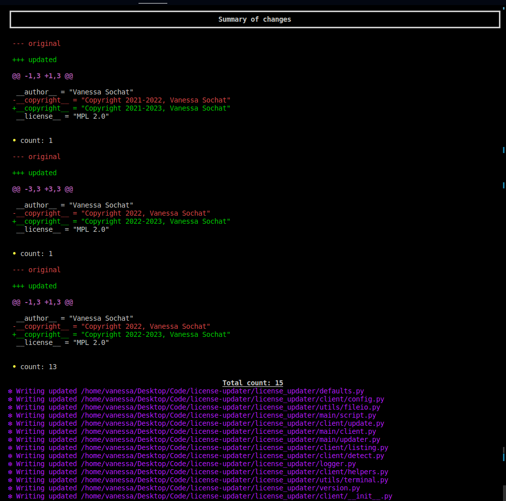
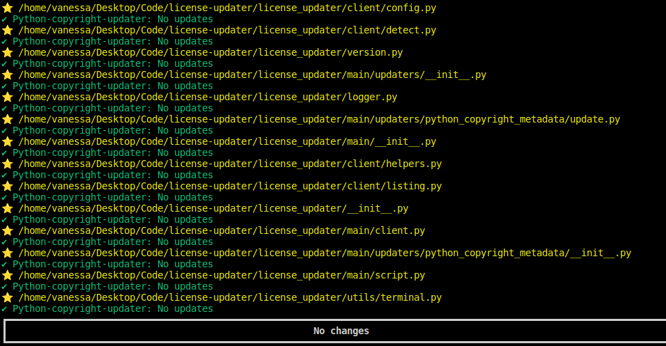

# License Updater

[](https://badge.fury.io/py/license-updater)
[](https://github.com/vsoch/license-updater/actions/workflows/main.yml)

<!-- ALL-CONTRIBUTORS-BADGE:START - Do not remove or modify this section -->
[](#contributors-)
<!-- ALL-CONTRIBUTORS-BADGE:END -->

Every year I go through projects and update license strings. It's OK for a few projects but can get really
arduous! Thus, I made this license updater to do exactly what I needed.

TODO

The actions updater will make it easy to update actions:

 - 🥑 updated syntax and commands
 - 🥑 versions of actions, either for releases or commits
 - 🥑 preview, write to new file, or write in place!
 - 🥑 run as a GitHub action workflow for annual checks!

You can see the [⭐️ Documentation ⭐️](https://vsoch.github.io/license-updater) for complete details!

## ⭐️ Quick Start ⭐️

### Installation

The module is available in pypi as [license-updater](https://pypi.org/project/license-updater/),
and to install we first recommend some kind of virtual environment:

```bash
$ python -m venv env
$ source env/bin/activate
```

And then install from pypi using pip:

```bash
$ pip install license-updater
```

### Usage

For all commands below, the actions updater can accept a directory with yaml files,
or a single yaml file that matches the GitHub actions schema.

View updaters available (and descriptions)

```bash
$ license-updater list-updaters
```
You should likely detect (to preview) before you write the changes to file.

```bash
# Run all updaters
$ license-updater detect .github/workfows/main.yaml

# Only detect for the setoutput updater
$ license-updater detect -u setoutput .github/workfows/main.yaml
```
And finally, write updates to file!

```bash
$ license-updater update .github/workfows/main.yaml
```

### 🎨 Screenshots 🎨

If a file has updates, it will print to the terminal the updated file for preview.



And after you run `update` (described below) you will see all green!



Running across many files:


And that's it! The action comes with several [updaters](https://vsoch.github.io/license-updater/developer-guide.html#updaters) that will look
for particular aspects to lint or update. If you have a request for a new updated, please
[open an issue](https://github.com/vsoch/license-updater/issues).

### Feature Ideas

This could be fairly easy to extend to allow for more "linting" style actions to reflect preferences in style, e.g:

```bash
$ license-updater lint .github/workflows/main.yaml
```

If this sounds interesting to you, please [open an issue](https://github.com/vsoch/license-updater) to discuss further!
We currently do some basic linting, as the yaml loading library has preferences for saving with respect to spacing, etc.

## 😁️ Contributors 😁️

We use the [all-contributors](https://github.com/all-contributors/all-contributors)
tool to generate a contributors graphic below.

<!-- ALL-CONTRIBUTORS-LIST:START - Do not remove or modify this section -->
<!-- prettier-ignore-start -->
<!-- markdownlint-disable -->
<table>
  <tbody>
    <tr>
      <td align="center" valign="top" width="14.28%"><a href="https://vsoch.github.io"><br /><sub><b>Vanessasaurus</b></sub></a><br /><a href="https://github.com/vsoch/license-updater/commits?author=vsoch" title="Code">💻</a></td>
    </tr>
  </tbody>
</table>

<!-- markdownlint-restore -->
<!-- prettier-ignore-end -->

<!-- ALL-CONTRIBUTORS-LIST:END -->

## License

This code is licensed under the MPL 2.0 [LICENSE](LICENSE).
